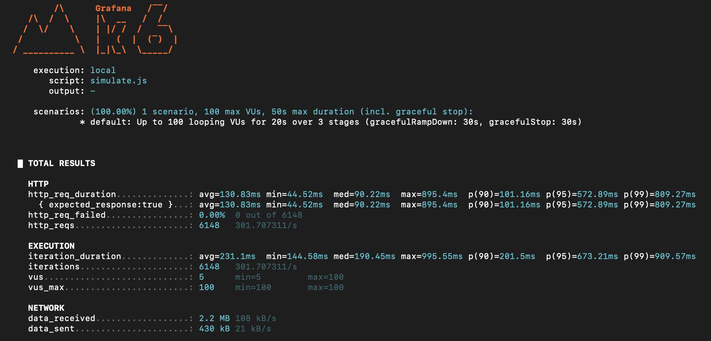
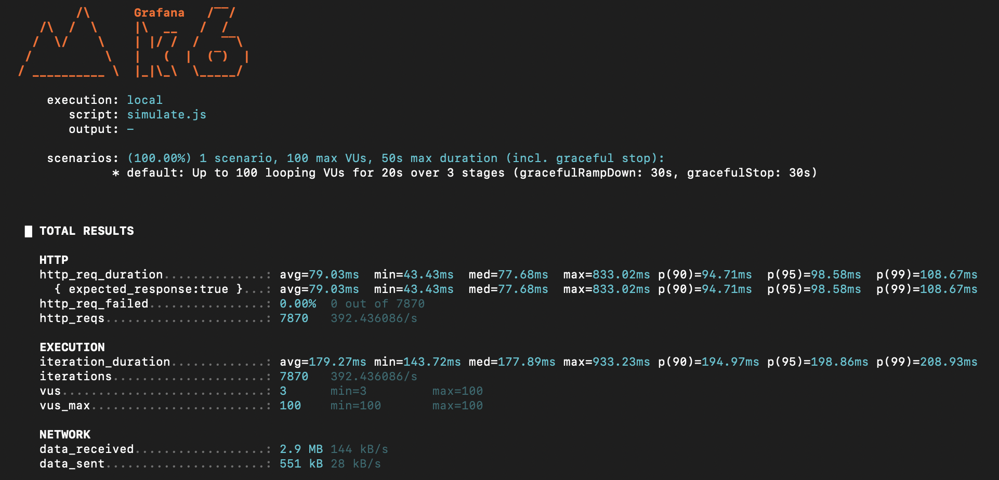

# ⚡ Understanding Tail Latency at Scale — Hedged & Tied Requests (POC)

Modern distributed systems often rely on **fan-out architectures**, where a single user request triggers multiple internal service calls. While this allows systems to scale and parallelize work, it also introduces a critical problem:

> **The overall latency is determined by the slowest service in the chain.**

Even if **most services respond quickly**, just **one slow instance** can delay the entire request.  
This is known as the **Tail Latency Problem**.

---

## 🚨 Why Tail Latency Matters

Imagine a service that fans out to **100 backend calls**.  
If each backend is **99% reliable**, meaning it is slow only **1% of the time**, then:

Probability that ALL 100 services are fast:

(0.99)^100 ≈ 0.36

So **64% of requests will experience slow latency** — despite each service individually being “fast 99% of the time”.

This shows:

- **Average latency doesn't matter at scale**
- **p95/p99 latency determines real user experience**
- **Small variance in service latency → huge system-level impact**

---

## 🏎️ Techniques to Reduce Tail Latency

### 1. **Hedged Requests**

If a request is taking longer than expected, send a **duplicate request** to **another replica**, and **use whichever response returns first**.

                            ┌─────────  backend A (maybe slow)
    client  ───► aggregator |
                            └───────── backend A' (backup)

**Pros**

- Improves worst-case latency dramatically
- Simple to reason about

**Cons**

- Increases load on backend services.

---

### 2. **Tied Requests**

Enhancement over hedged requests:

- Send **two requests upfront** to two replicas
- **Whichever replica starts processing first "wins"**
- The other request is **cancelled early**

This reduces wasted work on the losing replica.

                           ┌──── backend A (wins, continues work)
    client ───► aggregator |
                           └──── backend B (loses, receives cancellation signal)

**Pros**

- Lower tail latency
- Less wasted work than hedged requests

**Cons**

- Must support **request cancellation** cleanly in server logic
- Requires cooperative cancellation handling in code

---

## 📊 Local Simulation Results

The following load tests were run using `k6`:

| Mode     | p50      | p90       | p95       | p99       | Notes                              |
| -------- | -------- | --------- | --------- | --------- | ---------------------------------- |
| Standard | 90.22 ms | 101.16 ms | 572.89 ms | 809.27 ms | Baseline variant                   |
| Hedged   | 90.29 ms | 101.77 ms | 162.44 ms | 190.83 ms | Tail latency reduced but more load |
| Tied     | 77.68 ms | 94.71 ms  | 98.58 ms  | 108.67 ms | Best performance, less wasted work |

**Screenshots:**

_Standard_


_Hedged_


_Tied_


---

## 🛠️ Tech Stack

| Component               | Purpose                                         |
| ----------------------- | ----------------------------------------------- |
| Node.js + Express       | Backend services + aggregator                   |
| Docker & Docker Compose | Local orchestration                             |
| k6                      | Load testing & latency distribution measurement |

---

## 🚀 Running the POC Locally

### 1. Clone the Repository

```bash
git clone <repo-url>
cd <repo-folder>
```

### 2. Choose Mode

Set MODE to one of:

- standard — No mitigation against tail latency
- hedged — Send fallback requests after timeout
- tied — Send parallel requests and cancel the slower one

### 3. Run System via Docker Compose

```bash
MODE=standard docker compose up --build
```

or

```bash
MODE=hedged docker compose up --build
```

or

```bash
MODE=tied docker compose up --build
```

### 4. Send Requests

```bash
curl http://localhost:3000/
```

### 5. Load Test Example

```bash
k6 run simulate.js
```

## ✅ Conclusion

At small scales, average latency looks fine.
At large scale, even tiny slowdowns amplify due to fan-out effects.

| Mode     | p99 Latency Behavior | Extra Load | Complexity                     |
| -------- | -------------------- | ---------- | ------------------------------ |
| Standard | ❌ Bad               | ✅ Low     | ✅ Simple                      |
| Hedged   | ✅ Better            | ❌ Higher  | ✅ Simple-ish                  |
| Tied     | ⭐ Best              | ✅ Low     | ❌ Requires cancellation logic |

Key takeaway:

> To build truly scalable distributed systems, you must optimize tail latency, not average latency.
